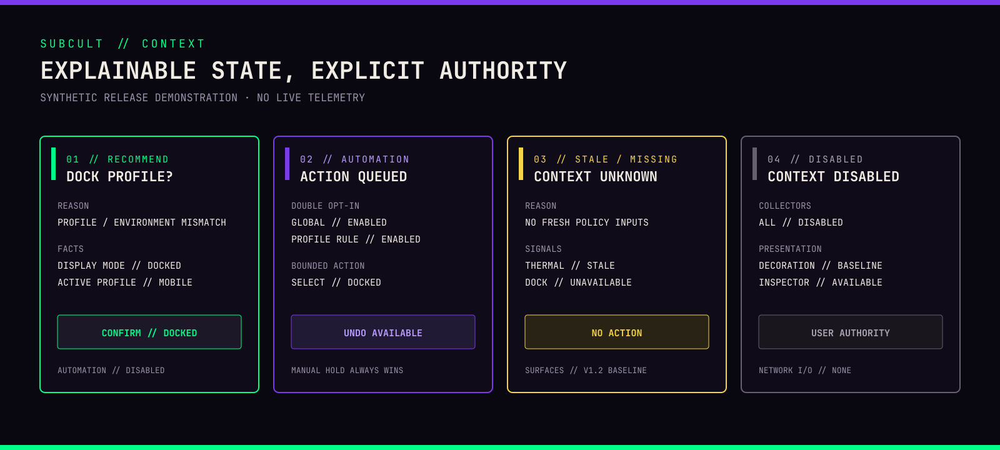

# SUBCULT Omarchy Rice

[](https://github.com/PatrickFanella/subcult-omarchy-rice/actions/workflows/validate.yml)

A complete Omarchy desktop in the SUBCULT poster-press identity: ink canvases,
paper text, violet fields, and acid-green registration blocks. It ships seven
wallpapers built from the SUBCULT marks, five affinity palettes, shell plugins,
menus and overlays, terminal profiles, safety telemetry, sounds, and operator
tools.

> **v2.0.0:** The suite formerly published as Evangelion Omarchy Rice is now
> SUBCULT. Commands are `subcult-*`, plugins are `subcult.*`, and the theme is
> `subcult`. Installing over Evangelion Rice 1.5 retires the old suite into the
> rollback snapshot and keeps your settings. See
> [UPGRADING.md](UPGRADING.md#upgrade-from-evangelion-rice-15-to-subcult-20).


Desktop, lock screen, and start-page captures for 2.0 have not been taken yet.
The 1.x screenshots showed the retired Evangelion interface and were removed.

## What it does

The [SUBCULT control center](SETTINGS.md) is one keyboard-first surface for
affinity, motion, profile, widget, weather, media, privacy, sound, display, and
bounded visual settings, with preview and one-step undo.
[Safe visual customization](VISUAL_CUSTOMIZATION.md) sets out its accessibility
and fallback rules.

Wallpaper selects an affinity palette automatically: Press, Acid Block, Paper
Stock, Violet Field, or Ink Run. [Theme variants](THEME_VARIANTS.md) layer
Standard, OLED, Daylight, or High Contrast treatment over every affinity with
preview and one-step revert. [Affinity scenes](SCENES.md) coordinate wallpaper,
palette, terminal identity, and opt-in ambient, motion, or sound behavior as one
reversible plan.

[Workspace identities](WORKSPACES.md) are user-editable, stay full-length in
the OSD, and collapse into collision-safe labels against the live bar width.
[Coordinated activity modes](ACTIVITY_MODES.md) provide manual, per-action
opt-in Work, Focus, Gaming, Presentation, Travel, and Quiet transactions.
[Media controls](MEDIA_CONTROLS.md) coordinate multiple MPRIS sources,
privacy-safe artwork, player detail, and Cava without moving bar geometry.

Monitor and dock layouts can be saved, previewed, restored, and undone with
[monitor topology profiles](TOPOLOGIES.md), and moved between machines as
[privacy-sanitized machine profiles](MACHINE_PROFILES.md).
[Optional surfaces stay usable offline](OFFLINE_RESILIENCE.md) with bounded
retries, cache-age labels, and privacy-safe unavailable states.
[Sound cues are opt-in and category controlled](SOUND.md), with quiet hours,
volume ceilings, scene overrides, visual equivalents, and a kill switch.

The [command palette](COMMAND_PALETTE.md) gives deterministic fuzzy search
across safe actions, settings, workspaces, diagnostics, and help. The
[private operations log](OPERATIONS_LOG.md) keeps bounded, searchable
notification and system history with explicit clear and export.
[Progressive telemetry disclosure](PROGRESSIVE_DISCLOSURE.md) keeps context,
health, history, and start-page surfaces quiet until you ask for detail.
[Accessibility standards](ACCESSIBILITY.md) define contrast, scaling, keyboard,
assistive semantics, motion, timeout, flashing, and documented platform limits.
The [community compatibility workflow](BETA_TESTING.md) produces a reviewed,
privacy-safe report and a maintainer-curated evidence matrix.



Software is MIT-licensed. The SUBCULT marks and fonts have separate terms; read
[ASSETS_LICENSE.md](ASSETS_LICENSE.md) before redistributing assets.

## Supported environment

| Component | Supported range | Verified reference |
|---|---|---|
| Omarchy | `>=4.0.0, <5.0.0` | 4.0.1-1 |
| Hyprland | `>=0.56.0, <0.57.0` | 0.56.2-1 |
| Architecture | x86_64 | ThinkPad T480, x86_64 |
| Session | Active Wayland/Hyprland session for installation activation | Omarchy |
| Displays | 1280×720 presentation minimum; 320×480 overlay minimum | 7 automated profiles from 1×–2× |
| Terminals | Ghostty, Alacritty, Foot, or Kitty | Ghostty and Foot |
| Shell integration | Bash, Zsh, or Fish; optional | Bash |
| Browser | Current XDG/Omarchy default | Zen and Chromium-compatible launchers |

The hardware references come from the 1.5 line, which 2.0 renames and recolors
without changing behavior. x86_64 is the supported release architecture. Other
Linux architectures are not blocked by source validation but remain unverified.
The T480 is a reference machine, not a hardware requirement. Battery-less,
multi-battery, Intel, AMD, generic thermal, missing-sensor, and optional-tool
fallbacks are implemented. See [RESPONSIVE.md](RESPONSIVE.md) for the display
matrix and [TESTING.md](TESTING.md) for what CI proves.

Support covers the version ranges above and reproducible repository behavior.
Third-party themes, arbitrary shell forks, and hardware-specific vendor tools
are best-effort. Include `./preflight.py --json` and `./validate.sh` output in a
bug report.

## Quick start

Choose the channel before installing. For only the palette and wallpapers:

```bash
omarchy theme install https://github.com/PatrickFanella/omarchy-subcult-theme.git
```

For the complete SUBCULT desktop, download the archive and matching checksum from
the [latest GitHub release](https://github.com/PatrickFanella/subcult-omarchy-rice/releases/latest),
verify them, extract, and run from an active Omarchy Hyprland session:

```bash
sha256sum --check subcult-omarchy-rice-2.0.0.tar.gz.sha256
tar -xzf subcult-omarchy-rice-2.0.0.tar.gz
cd subcult-omarchy-rice-2.0.0
./scripts/build-release verify-root .
./preflight.py
./install.sh --dry-run --preset default
./install.sh --apply --preset default
omarchy theme set subcult
./validate.sh
```

Contributors and testers can follow the Git checkout instead:

```bash
git clone git@github.com:PatrickFanella/subcult-omarchy-rice.git
cd subcult-omarchy-rice
./preflight.py
./install.sh --dry-run --preset default
./install.sh --apply --preset default
omarchy theme set subcult
./validate.sh
```

Use the HTTPS clone URL if SSH is not configured. Arch users can use the
checksum-pinned `PKGBUILD` attached to the release and the explicit activation
workflow in [ARCH_PACKAGING.md](ARCH_PACKAGING.md). AUR publication is deferred.
Always review the dry run. The default preset replaces complete Omarchy shell
and Hyprland configuration files after confirmation. The preflight is read-only
and stops unsafe installs before the first backup or write.

Presets:

- `minimal`: theme and command-line tools only.
- `default`: minimal plus shell, Hyprland, start page, and user services.
- `full`: default plus Fastfetch/Neovim extras and detected-shell integration.

Select individual components with `--components`, override shell detection with
`--shell bash|zsh|fish`, or use `--no-shell-integration`. See
[INSTALL.md](INSTALL.md) for prerequisites, package commands, component and
path effects, transaction behavior, and first-run verification. Use
[DISTRIBUTION_GUIDE.md](DISTRIBUTION_GUIDE.md) to choose between just the look,
a complete release, a development checkout, and managed Arch packaging.
[DISTRIBUTION.md](DISTRIBUTION.md) is the ownership contract for those channels.

The theme installs the Oswald, Space Grotesk, and JetBrains Mono brand fonts to
`~/.local/share/fonts/subcult`.

## Configuration

Personal settings live in `~/.config/omarchy/subcult.json`, which the installer
creates once and preserves on upgrades. Terminal, editor, shell, project path,
deployment, presentation, browser selection, weather, operating profiles,
global motion level, local context controls, thermal thresholds, and optional
integrations are documented in [CONFIGURATION.md](CONFIGURATION.md). Context
inputs, the privacy boundary, precedence, reasons, recommendations, automation
controls, accessibility behavior, and performance limits are in
[CONTEXT.md](CONTEXT.md).

Distribution boundaries, the plugin audit, and the small optional-integration
contract are in [DISTRIBUTION.md](DISTRIBUTION.md),
[PLUGIN_AUDIT.md](PLUGIN_AUDIT.md), and [SUBCULT_RUNTIME.md](SUBCULT_RUNTIME.md).
Exact-tag suite archives, checksums, provenance, and offline installation are
in [RELEASE_ARTIFACTS.md](RELEASE_ARTIFACTS.md). Arch package ownership and
per-user activation are in [ARCH_PACKAGING.md](ARCH_PACKAGING.md). Channel
transitions, conflicts, and CI evidence are in [CROSS_CHANNEL.md](CROSS_CHANNEL.md).
The release, theme-gallery, packaging, and privacy review workflow for
contributors is in [MAINTAINING.md](MAINTAINING.md).

The browser always follows `omarchy launch browser`; no browser executable is
hard-coded. Cava is an independent `subcult.cava` bar plugin and hides when
Cava is unavailable. Neon Overdrive is a separately selected compatibility
component for that third-party theme and is never installed by a preset.

More references:

- Controls and keybindings: [HOTKEYS.md](HOTKEYS.md)
- Deterministic screenshots, onboarding, and private bug reproduction: [DEMO.md](DEMO.md)
- String catalog, pseudo-locale, RTL, and formatting: [LOCALIZATION.md](LOCALIZATION.md)
- Startup, idle, polling, overlap, and cache ceilings: [PERFORMANCE.md](PERFORMANCE.md)
- Suite integrity diagnosis and reversible remediation: [RICE_HEALTH.md](RICE_HEALTH.md)
- Named configuration snapshots and selective restore: [SNAPSHOTS.md](SNAPSHOTS.md)

## Upgrade, rollback, and removal

For Stable, Preview, and Development suite updates with change preview,
validation, and one-command undo, use the [guided suite updater](SUITE_UPDATES.md).
It is separate from operating-system updates wrapped by `subcult-update`.

New installations and privacy-sanitized preference transfer are covered by the
[first-run onboarding guide](ONBOARDING.md).

If custom shell or Hyprland configuration cannot load, `subcult-recovery enter`
activates a stock-only static layout after taking an exact local snapshot. Use
`Super + Alt + R` when the compositor responds, or run it from a TTY.
`subcult-recovery exit` restores the prior configuration. See
[HOTKEYS.md](HOTKEYS.md#static-recovery-mode) for the full recovery path.

Run `subcult-migrate preview` before applying a configuration upgrade. It names
every preserved setting and replacement and requires `keep` or `replace` for
each conflict. Interrupted applies wait for an explicit `subcult-migrate recover`.

Every changed target is recorded in a transaction snapshot under
`~/.local/state/subcult-rice/install-backups/`. Failed activation or validation
rolls back the active transaction automatically.

```bash
./rollback.sh
./rollback.sh /path/to/snapshot
```

Installing 2.0 over Evangelion Rice 1.5 moves the old `evangelion.*` plugins,
`magi-*` and `eva-*` commands, services, hooks, and shell snippets into that
snapshot, so one rollback restores the previous desktop exactly. Users of the
original v1.0-era installation also get a rollback-safe migration from
`so1omon.*` to `subcult.*` plugin IDs. Read [UPGRADING.md](UPGRADING.md) before
upgrading or removing a multi-transaction installation. A rollback reverses one
transaction, not the whole history.

## Troubleshooting and validation

Start with `./preflight.py --json` and `./validate.sh`.
[TROUBLESHOOTING.md](TROUBLESHOOTING.md) covers shell and plugin loading,
services, wallpapers, weather, media, Cava, sensors, and hotkey conflicts.
Contributor checks are:

```bash
./tests/installer.sh
./tests/legacy-upgrade.sh
./tests/clean-user.sh
./tests/responsive-layouts.py
./tests/motion-regression.py
./tests/motion-observe.py # optional live observation
./tests/context-regression.py
./tests/subcult-extension-contract.py # internal widget state boundary
./tests/visual-regression.py --self-test # canonical privacy-safe frames and CI diffs
./tests/performance-overlay.py # opt-in aggregate developer telemetry
./tests/context-observe.py # optional live observation; restores state
```

CI keeps machine-readable clean-user and responsive-layout artifacts. See
[AUDIT.md](AUDIT.md) for release verification and
[theme/ARTWORK.md](theme/ARTWORK.md) for wallpaper provenance. Release history
is in [RELEASE_NOTES.md](RELEASE_NOTES.md).

## Credits and license

SUBCULT Omarchy Rice is a fork of
[so1omon563/evangelion-omarchy-rice](https://github.com/so1omon563/evangelion-omarchy-rice).
Its shell, plugins, tooling, and tests come from that project; 2.0 replaces the
branding, palettes, and artwork.

Software and configuration source are MIT-licensed. Brand assets and fonts are
excluded from that grant; see [ASSETS_LICENSE.md](ASSETS_LICENSE.md).
