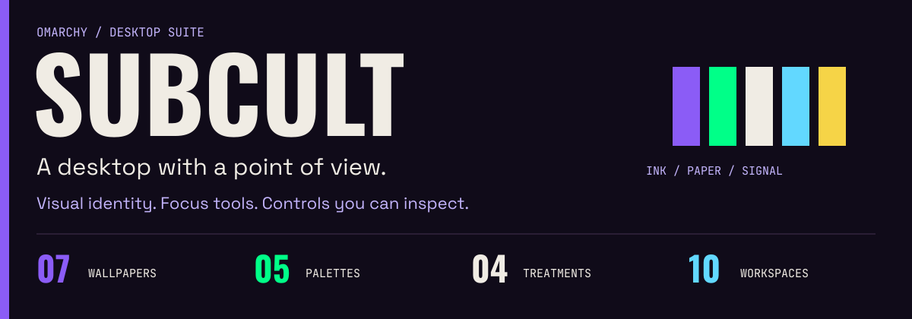
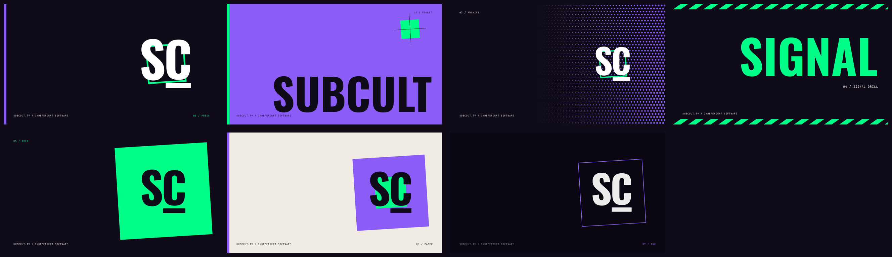
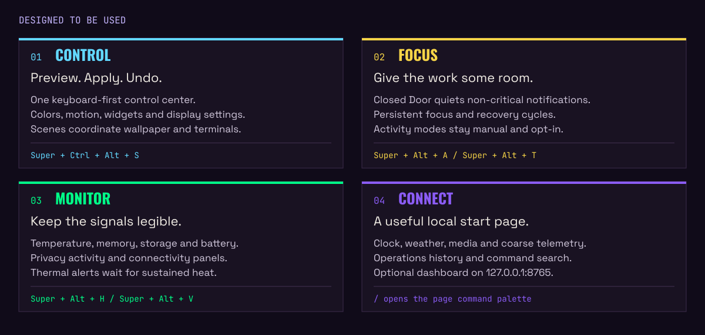
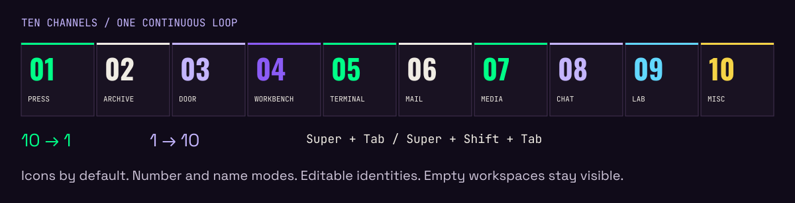

# SUBCULT Omarchy Rice



[](https://git.subcult.tv/PatrickFanella/subcult-omarchy-rice/actions?workflow=validate.yml)

**A complete Omarchy desktop with the SUBCULT visual identity, keyboard-first
controls, focus tools, and system monitoring.**

Ink canvases, paper text, violet fields, and acid-green accents carry through
wallpapers, the shell, menus, overlays, and terminals. Beneath the look:
editable workspaces, reversible settings, media controls, privacy indicators,
a local dashboard, and recovery tools.

[Get started](#get-started) · [Explore the features](#a-desktop-you-can-shape) ·
[Controls](HOTKEYS.md) · [Configuration](CONFIGURATION.md) ·
[Releases](https://git.subcult.tv/PatrickFanella/subcult-omarchy-rice/releases/latest)

## The look



Seven wallpapers select five matching palettes: **Press, Acid Block, Paper
Stock, Violet Field, and Ink Run**. Layer **Standard, OLED, Daylight, or High
Contrast** treatment over any palette. Keep wallpaper-driven color, hold a
manual override, or save a scene that coordinates wallpaper, palette, and
terminal identity.

The same identity extends to Ghostty, Alacritty, Kitty, Foot, Starship, fzf, bat,
lazygit, and compatible Neovim accents. New terminals can also choose an isolated
profile from project markers and path rules.

[Theme treatments](THEME_VARIANTS.md) · [Affinity scenes](SCENES.md) ·
[Visual customization](VISUAL_CUSTOMIZATION.md)

## A desktop you can shape



| Feature | What you get |
|---|---|
| **Control center** | One keyboard-first surface for color, motion, widgets, media, sound, weather, and displays. Preview, apply, and undo changes. |
| **Focus tools** | Closed Door quiets non-critical notifications and changes the bar and active border. A persistent mission timer handles work and recovery cycles. |
| **Health and privacy** | Temperature, memory pressure, home storage, battery condition, services, network, and updates. Inspect microphone, camera, sharing, recording, and known remote-control activity. |
| **Sustained heat alerts** | Separate warning and critical thresholds, dwell times, cooldowns, and recovery temperatures. Default dwell times are two minutes and one minute; brief spikes do not notify. |
| **Media** | Multiple MPRIS sources, transport controls, player details, and local artwork. Optional Cava spectrum activity follows playback. |
| **Profiles and context** | Save monitor layouts and mobile/docked profiles. Inspect local context observations and their reasons. Automation requires opt-in. |
| **Activity modes** | Work, Focus, Gaming, Presentation, Travel, and Quiet coordinate the actions you explicitly enable, with preview and undo. |
| **Local dashboard** | Optional browser start page with clock, weather, media, coarse telemetry, command search, and operations history. |
| **Recovery and history** | Searchable local operations log, named settings snapshots, transactional installation backups, and a stock-only recovery mode. |

Full, Reduced, and Off motion levels are available. Sound cues are opt-in, with
quiet hours and volume limits. Remote album artwork is blocked by default.
Optional tools and sensors report availability independently.

[Settings](SETTINGS.md) · [Media](MEDIA_CONTROLS.md) ·
[Activity modes](ACTIVITY_MODES.md) · [Context](CONTEXT.md) ·
[Sound](SOUND.md) · [Offline behavior](OFFLINE_RESILIENCE.md)

### Ten workspaces, one continuous loop



All ten workspaces remain visible, including empty ones. **Icons are the default**;
switch to numbers, names, or responsive Auto labels. Each workspace has an
editable identity, icon, compact token, channel, and accent color. Tooltips and
the transition overlay retain the full identity.

- **Next / previous:** `Super+Tab` / `Super+Shift+Tab`, wrapping **10 → 1** and **1 → 10**.
- **Pointer navigation:** `Super+mouse wheel` follows the same order.
- **Direct selection:** `Super+1–9`; `Super+0` opens workspace 10.
- **Edit:** open the Control Center and press `W`, or use the Workspace Identities menu.

[Workspace kits](WORKSPACE_KITS.md) attach applications, project directories,
terminal profiles, and links to Dash, Development, Browsing, Journal, Social
Media, Mail, Media, Chat, Calendar, and Misc. Each launch is previewed and
explicitly confirmed.

Portable import/export and live bar refresh are included. See [WORKSPACES.md](WORKSPACES.md).

### A bar that follows the desktop

The suite combines workspace identities, media, focus state, communications,
privacy, health, and context with Omarchy's native controls. Native widget
adapters retain their original panels and interactions while following the
active palette.

Customize the layout in `~/.config/omarchy/shell.json`. Third-party task,
calendar, radio, pipeline, fleet, or notification widgets can be added through
their own integrations; their services and accounts are configured separately.

[Adaptive visibility](ADAPTIVE_BAR.md) can quiet optional media, spectrum,
mission and world-clock widgets according to workspace and activity.
Safety indicators stay pinned.

[Bar icon behavior](BAR_ICONS.md) · [Configuration](CONFIGURATION.md)

### An optional local start page

The dashboard runs at **http://127.0.0.1:8765/** and opens in your current
Omarchy/XDG browser. It remains useful offline, labels cached weather, and
honors reduced motion. Press `/` for command search; choose Compact, Standard,
or Full density.

Install it with `--with-start-page`, or add it later:

```bash
./install.sh --apply --components start-page
subcult-start-page open
```

The start page is an optional add-on for every preset, including `full`.
Its user service is enabled when the component is installed.

The feature illustrations above are project-authored diagrams, not desktop
screenshots. SUBCULT 2.0 desktop and lock-screen captures are still pending.

## Get started

Run from an active **Omarchy Hyprland session**. Start with the read-only
preflight and review the installation plan.

```bash
git clone https://git.subcult.tv/PatrickFanella/subcult-omarchy-rice.git
cd subcult-omarchy-rice
./preflight.py
./install.sh --dry-run --preset default
./install.sh --apply --preset default
omarchy theme set subcult
./validate.sh
```

The `default` preset replaces complete shell and suite-owned Hyprland
configuration files after confirmation. Changed targets are backed up before
replacement; activation or validation failures roll back the transaction.
Personal settings in `~/.config/omarchy/subcult.json` are preserved on upgrades.

| Preset | Includes |
|---|---|
| `minimal` | Theme and command-line tools |
| `default` | Minimal plus shell, Hyprland configuration, and user services |
| `full` | Default plus Fastfetch/Neovim extras and detected-shell integration |

Select individual components with `--components`, choose `--shell bash|zsh|fish`,
or skip startup-file integration with `--no-shell-integration`. Brand fonts
Oswald, Space Grotesk, and JetBrains Mono install under
`~/.local/share/fonts/subcult`.

[Installation and prerequisites](INSTALL.md) ·
[Choose an installation channel](DISTRIBUTION_GUIDE.md) ·
[First-run onboarding](ONBOARDING.md)

<details>
<summary><strong>Install a verified release archive</strong></summary>

Download the archive and matching checksum from the
[latest release](https://git.subcult.tv/PatrickFanella/subcult-omarchy-rice/releases/latest).
For the 2.0.0 archive:

```bash
sha256sum --check subcult-omarchy-rice-2.0.0.tar.gz.sha256
tar -xzf subcult-omarchy-rice-2.0.0.tar.gz
cd subcult-omarchy-rice-2.0.0
./scripts/build-release verify-root .
./preflight.py
./install.sh --dry-run --preset default
./install.sh --apply --preset default
omarchy theme set subcult
./validate.sh
```

Use the filenames supplied with your chosen release. Exact-tag archives,
checksums, provenance, and offline installation are documented in
[RELEASE_ARTIFACTS.md](RELEASE_ARTIFACTS.md).

</details>

The canonical repository, issues, releases, and CI are on **Gitea at
git.subcult.tv**. GitHub is a read-only mirror with Actions disabled. Arch users
can use the checksum-pinned release `PKGBUILD` and explicit activation workflow
in [ARCH_PACKAGING.md](ARCH_PACKAGING.md); AUR publication is deferred.

The complete suite is the current install path; this palette and wallpaper
collection is not yet published as a standalone Omarchy theme. The older
`PatrickFanella/omarchy-subcult-theme` project is a different theme with the same
install name. The suite refuses to merge into that Git-owned theme directory.

## Learn the controls

`Super` is the Windows key. `Super+K` shows every live Omarchy binding.

| Shortcut | Action |
|---|---|
| `Super+M` | SUBCULT menu |
| `Super+Ctrl+Alt+M` | Global command palette |
| `Super+Ctrl+Alt+S` | Control Center |
| `Super+Alt+A` | Closed Door focus mode |
| `Super+Alt+T` | Mission timer |
| `Super+Alt+H` | System health |
| `Super+Alt+V` | Privacy activity |
| `Super+Ctrl+Alt+G` | Context inspector |
| `Super+Ctrl+Alt+O` | Operations log |
| `Super+Alt+P` | Media play/pause |
| `Super+Alt+R` | Stock-only recovery |

In the Control Center: **Enter** previews, **A** applies, **U** undoes, **W**
opens workspace editing, and **C** opens scene editing. Use arrows or H/J/K/L
to navigate. The complete reference is [HOTKEYS.md](HOTKEYS.md).

## Supported environment

| Component | Supported range | Verified reference |
|---|---|---|
| Omarchy | `>=4.0.0, <5.0.0` | 4.0.1-1 |
| Hyprland | `>=0.56.0, <0.57.0` | 0.56.2-1 |
| Architecture | x86_64 | ThinkPad T480, x86_64 |
| Session | Active Wayland/Hyprland session for activation | Omarchy |
| Displays | 1280×720 presentation minimum; 320×480 overlay minimum | Seven automated profiles from 1×–2× |
| Terminals | Ghostty, Alacritty, Foot, or Kitty | Ghostty and Foot |
| Shell integration | Bash, Zsh, or Fish; optional | Bash |
| Browser | Current XDG/Omarchy default | Zen and Chromium-compatible launchers |

The hardware references come from the 1.5 line, which 2.0 renames and recolors.
The T480 is a reference, not a requirement. Battery-less, multi-battery, Intel,
AMD, generic thermal, and missing-sensor fallbacks are implemented. Other
architectures remain unverified.

Support covers the version ranges above and reproducible repository behavior.
Third-party themes, shell forks, and vendor-specific hardware tools are
best-effort. [RESPONSIVE.md](RESPONSIVE.md) documents the display matrix;
[TESTING.md](TESTING.md) explains what CI proves.

## Updates and recovery

Use the [guided suite updater](SUITE_UPDATES.md) for Stable, Preview, and
Development channels, change previews, validation, and undo. Suite updates are
separate from operating-system updates wrapped by `subcult-update`.

If the custom shell cannot load, use `Super+Alt+R` or switch to a TTY and run:

```bash
subcult-recovery enter
# Restore your captured configuration:
subcult-recovery exit
```

Recovery preserves applications, plugins, and preferences. Installation
transactions are stored under `~/.local/state/subcult-rice/install-backups/`.
`./rollback.sh` restores one transaction; it does not erase the installation
history.

**Upgrading from Evangelion Rice:** SUBCULT 2.0 renames commands to
`subcult-*`, plugins to `subcult.*`, and the theme to `subcult`. The installer
moves the old suite into the rollback snapshot and preserves settings.
Read [UPGRADING.md](UPGRADING.md) before upgrading or removing an installation.

## Documentation

| Area | Guides |
|---|---|
| Everyday use | [Controls](HOTKEYS.md), [settings](SETTINGS.md), [workspaces](WORKSPACES.md), [command palette](COMMAND_PALETTE.md), [media](MEDIA_CONTROLS.md) |
| Appearance | [Visual customization](VISUAL_CUSTOMIZATION.md), [treatments](THEME_VARIANTS.md), [scenes](SCENES.md), [sound](SOUND.md), [accessibility](ACCESSIBILITY.md) |
| Context and machines | [Context](CONTEXT.md), [activity modes](ACTIVITY_MODES.md), [monitor layouts](TOPOLOGIES.md), [portable profiles](MACHINE_PROFILES.md), [offline behavior](OFFLINE_RESILIENCE.md) |
| Diagnostics | [Troubleshooting](TROUBLESHOOTING.md), [rice integrity](RICE_HEALTH.md), [operations log](OPERATIONS_LOG.md), [telemetry detail](PROGRESSIVE_DISCLOSURE.md), [snapshots](SNAPSHOTS.md) |
| Setup and distribution | [Configuration](CONFIGURATION.md), [installation](INSTALL.md), [onboarding](ONBOARDING.md), [distribution guide](DISTRIBUTION_GUIDE.md), [ownership contract](DISTRIBUTION.md), [cross-channel behavior](CROSS_CHANNEL.md) |
| Releases | [Suite updater](SUITE_UPDATES.md), [upgrading](UPGRADING.md), [release artifacts](RELEASE_ARTIFACTS.md), [Arch packaging](ARCH_PACKAGING.md), [release notes](RELEASE_NOTES.md) |
| Contributors | [Testing](TESTING.md), [maintenance](MAINTAINING.md), [community reports](BETA_TESTING.md), [demo/reproduction](DEMO.md), [localization](LOCALIZATION.md), [performance](PERFORMANCE.md), [audit](AUDIT.md) |
| Architecture and assets | [Plugin audit](PLUGIN_AUDIT.md), [internal runtime](SUBCULT_RUNTIME.md), [artwork provenance](theme/ARTWORK.md), [README media sources](media/README.md), [asset terms](ASSETS_LICENSE.md) |

Start diagnosis with `./preflight.py --json` and `./validate.sh`. Include their
output in a bug report. Contributor checks and optional live observations are
listed in [TESTING.md](TESTING.md).

## Credits and license

SUBCULT Omarchy Rice is a fork of
[so1omon563/evangelion-omarchy-rice](https://github.com/so1omon563/evangelion-omarchy-rice).
Its shell, plugins, tooling, and tests come from that project; 2.0 replaces the
branding, palettes, and artwork.

Software and configuration source are **MIT-licensed**. SUBCULT brand assets
and bundled fonts have separate terms; read [ASSETS_LICENSE.md](ASSETS_LICENSE.md)
before redistribution.

[Heat investigation](HEAT_INVESTIGATION.md) adds an opt-in local timeline of temperatures, fan speeds, power profiles, and CPU contributors.

[Desktop recipes](DESKTOP_RECIPES.md) coordinate workspace, scene, focus, and motion with preview, confirmation, and undo.

[Workspace dashboard](WORKFLOW_DASHBOARD.md) follows the active workspace with tool links, attention items, and bounded local task/build summaries.

[Desktop journal](DESKTOP_JOURNAL.md) searches sanitized local history and adds opt-in state events, explicit notes, and retained session summaries.

[Configuration studio](CONFIGURATION_STUDIO.md) provides live design previews, guarded apply and undo, and portable visual presets.
